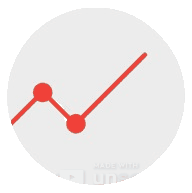

<!-- Intro  -->
<h1 align="center">
        <samp>&gt;  Hey There!, I am
                <b><a target="_blank" href="https://github.com/TAM-DS">Tracy Anne Griffin Manning</a></b>
        </samp>
<h2 align="center">🚀 AI & ML Solutions Architect</h2>
</h1>

### Welcome!

### About me:

Transforming business operations through cloud-native AI and ML solutions with intelligent automation. As a technology leader and entrepreneur, I leverage my experience as a cofounder to deliver strategic consulting services that drive innovation and sustainable growth for startups and enterprises.

Here's a glimpse into my world:

🧩 Core Expertise

- GCP Architecture & LLM Engineering
- TensorFlow & Deep Learning
- FinOps & AI-Driven Budgeting
- Python Development 
- Data Science and Machine Learning
- Blockchain + Smart Contracts 
  
 Featured Projects 
Enterprise AI Solutions 

- AI Knowledge Worker - RAG-powered system for company-wide expertise
- Smart Meeting Assistant - Speech-to-text pipeline generating minutes and action items
- Intelligent Brochure Generator - Web-scraping AI for automated content creation
- linear and polynomial regression - machine learning models with Blockchain API
- Cluster cryptocurrencies - with machine learning techniques
  
 Deep Learning Research

- Customer Churn Prediction - Neural networks for retention analysis
- Market Forecasting - RNN-based stock price prediction
- Fraud Detection - Self-organizing maps for anomaly detection
- Recommendation Engine - Boltzmann machines for personalized suggestions
- Differential privacy project to encrypt datasets
- Deep learning differential - privacy query
- Data encryption - to a machine learning model with federated learning

 Innovation Lab

- Python-to-C++ Optimizer - 60,000x performance boost through AI translation
- Price Prediction Engine - Frontier models for product pricing
- Deal Detection System - Autonomous agents for bargain hunting
- Netflix Prize Challenge - Stacked autoencoders for rating prediction

 Technical Philosophy
Building scalable data and ML solutions that transform raw data into actionable insights while optimizing cloud costs through FinOps principles. 

🔗 Let's Connect
- 🌍  I'm based in Austin, TEXAS
- ⚡ My secret weapon: Revenue Operations (RevOps), integrating sales, marketing, and customer success technologies and processes.
- ✉️  You can contact me at [manning.tracy@gmail.com](mailto:manning.tracy@gmail.com) [tmanning@post.harvard.edu](mailto:tmanning@post.harvard.edu)
- 📝 I regularly write articles on [www.linkedin.com/in/tracy-anne-griffin-manning](https://www.linkedin.com/in/tracy-anne-griffin-manning/)
- 💬 Ask me about **Fractional Consulting** Fractional consultants are secret weapons, slipping into high-level roles at companies that need top-tier expertise without the full-time commitment.

🔹 10 years delivering enterprise tech & financial leadership

🔹 Core Competencies:
- Tech architecture, cloud infrastructure & security expertise paired with financial modeling & risk management
- Strategic planning focused on scaling organizations, M&A, fundraising & digital transformation  
- Executive leadership experience with a proven track record in team building & stakeholder management

🔹 Advisory Experience:
- Technology/financial roadmap development
- Organizational assessment & change management
- System integration & digital transformation
- Board & C-suite presentations

 

## Connect with me:

## Some of my favorite tools and languages:

                             

## Trophy

 

        

  

   <table>
      <h1 align="center"> **Github Stats:**</h1>
      

              
      

        
 
                
        

        

                
         

   </table>

  

