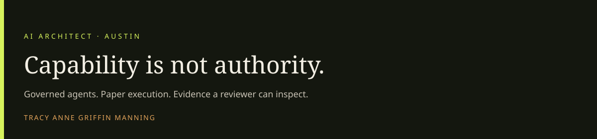

AI Architect · Austin, Texas · [Website](https://tam-ds.github.io/) · [Email](mailto:tmanning@post.harvard.edu) · [LinkedIn](https://www.linkedin.com/in/tracymanning) · [X](https://x.com/TAGM2025)

I design agentic systems where a model can propose and cannot grant itself permission. Financial services trained the consequence. Founding trained the ownership. The public repos are the parts a reviewer can inspect.

**Current:** Founder, Apex AI|ML. **Prior:** Minotaur Consulting · Office of the CIO · Wall Street.

## Start here

| Order | Repository | What it proves | Where it stops |
| --- | --- | --- | --- |
| 01 | [Agent Foundry](https://github.com/TAM-DS/agent-foundry) | Capability, identity, and runtime grants are separate. 399 tests. AWS DEV. | Not a customer-production system. |
| 02 | [Monster Heavy](https://github.com/TAM-DS/monster-heavy) | Durable paper execution survives retry, concurrency, and worker death. | No broker. No real-money path. |
| 03 | [AI-Ready Data Platform](https://github.com/TAM-DS/ai-ready-data-platform) | Three specialists. Claims checked against bounded facts. | Fixture timing is not a live-model speedup. |
| 04 | [Research desk](https://github.com/TAM-DS/capital-markets-research-desk) | Equities and energy agents draft. A clerk accepts. | A memo is not an order. |
| 05 | [Investment gems](https://github.com/TAM-DS/investment-gems) | Local six-name synthetic screen across equities and energy exposure. | A watchlist is not a ticket. |
| 06 | [Paper trading floor](https://github.com/TAM-DS/paper-trading-floor) | Three stdio MCP servers expose fixture, risk, and paper OMS tools. | Venue tool is denied. |

Monster Light, Monster Heavy, and Monster Desk are one paper boundary at three depths. AEGIS Evidence and BALLAST stay public for assurance and scenario questions. They are not the front door.

## The rule

A recommendation is not permission. Approval is bound to the exact action. Current evidence is checked again at execution. If the control cannot be shown, the claim is not made.

## Fixture dashboards

Three static HTML fixture views, not live feeds or observed market data. Three desks, one limit. Research can write a memo. The screen can write a watchlist. Only the paper floor can write a fill, and that fill has no venue. Its three MCP servers are verified over stdio; the research and screening examples are deterministic.

- [Research desk dashboard](https://github.com/TAM-DS/capital-markets-research-desk/blob/main/docs/index.html) rejects a stale curve and an unsourced headline.
- [Investment gems dashboard](https://github.com/TAM-DS/investment-gems/blob/main/docs/index.html) shows the hurdle and the invalidation.
- [Paper floor dashboard](https://github.com/TAM-DS/paper-trading-floor/blob/main/docs/index.html) shows the ERCOT paper fill and the denied venue tool.

## What is not public

Paid client material stays private for the required retention period. FinOps repositories are modeled scenarios with the formulas embedded. The dollar figures there are not delivered client savings. Employment outcomes live on the resume, not in a repository claim.

## Open to

Senior seats in AI architecture, enterprise AI, cloud and AI platforms, technical consulting, and technical chief of staff. Austin, Dallas, Houston, or San Antonio. In office or hybrid.

Close enough to build. Senior enough to say no.
